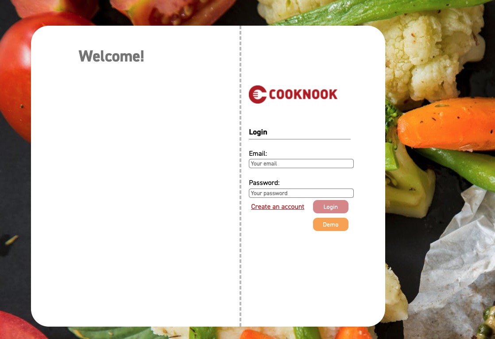
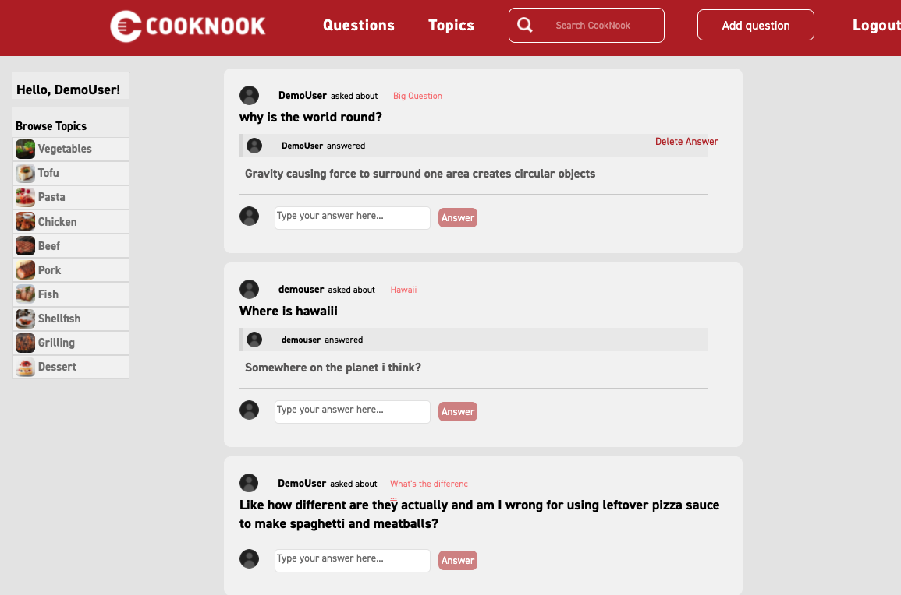
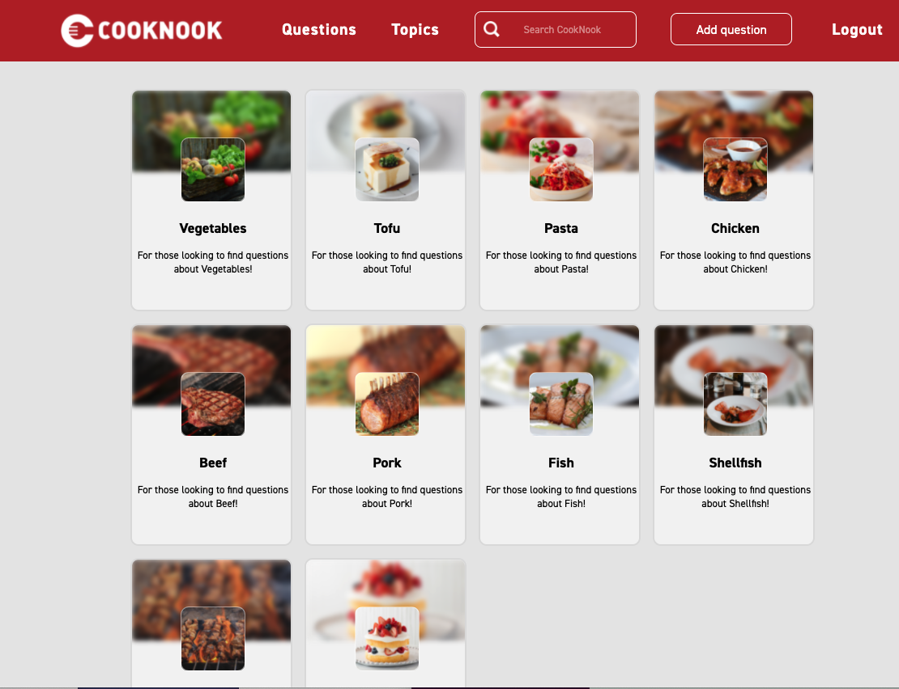

# CookNook

  CookNook is a clone of Quora with an emphasis on cooking and food! Users are able to signup and login, create questions, answer questions, see questions sorted by topic and search for questions! 
  
# Technology Used

# To get started:

1. Clone this repo
  * git clone https://github.com/AndrewPMurray/CookNook.git

2. Install dependencies
  * npm install

3. Create a POSTGRESQL user with CREATEDB and PASSWORD in PSQL.
  * CREATE USER <'name'> WITH CREATEDB PASSWORD <'password'>

4. Create a .env file in the backend directory based on the .env.example

5. Enter your username and password information into your .env file along with your desired database name, a
   secured combination of characters for your JWT_Secret, and your PORT(generally 5000)

6. Add the following proxy to your package.json file within your frontend directory, replacing or
   keeping the 5000 port to match your PORT configuration found in your .env file.
  * "proxy": "http://localhost:5000"

7. Create database, migrate, and seed models:
  * npx dotenv sequelize db:create
  * npx dotenv sequelize db:migrate
  * npx dotenv sequelize db:seed:all
 
8. Start the server by running npm start!

9. A demo user button is available to use or you may create a new user account by clicking on "Sign up" in the nav bar.

# Features

# Questions

Once users are logged in they are redirected to a feed of all the questions sorted by the most recently asked. From the nav bar they can create questions and search for them. They can also answer questions either on the feed or from the individual question page. 

# Topics

Users can also find questions sorted by category, we used JavaScript and a SQL query to set this up. 

